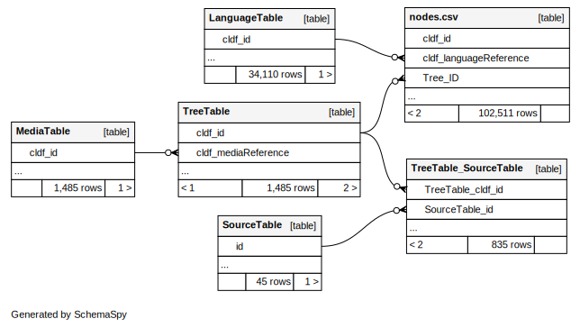

# Using the MultiTree CLDF dataset

## It's just CLDF

Thus, you can do whatever can be done with CLDF, see https://github.com/cldf/cookbook.


## Showing a tree

The MultiTree dataset comes with a [custom `cldfbench` command](https://github.com/cldf/cldfbench/blob/master/src/cldfbench/commands/README.md)
to show a particular tree and the related data in a terminal screen.

```shell
$ cldfbench multitree.show 12067 --named-nodes

Xincan: Campbell 1997

Source:
    Campbell (1997) [166]
                                ┌─Jutiapa
                ┌─Yupiltepeque──┤
                │               └─Yupiltepeque
──Xincan────────┼─Jumaytepeque
                ├─Guazacapán
                └─Chiquimulilla

Label    Name           Glottocode    Type      Geography    Status
-------  -------------  ------------  --------  -----------  --------
xink     Xincan                       Subgroup  Guatemala
qco      Yupiltepeque                 Language               Extinct
qco-jut  Jutiapa                      Dialect
qco-yup  Yupiltepeque                 Dialect
qhq      Jumaytepeque                 Language
qda      Guazacapán                   Language
2df      Chiquimulilla                Language

References:
Campbell, Lyle. 1997. American Indian Languages: The Historical Linguistics of Native America. Oxford: Oxford University Press.
```


## Using CLDF SQL

The SQLite database which can be created from the dataset running
```shell
cldf createdb cldf multitree.sqlite
```
has the following schema:



So to list the 10 biggest trees in terms of number of nodes, you could run:

```sql
sqlite> SELECT t.cldf_description AS name, count(n.cldf_id) AS nc
FROM TreeTable AS t, "nodes.csv" AS n
WHERE n.Tree_ID = t.cldf_id
GROUP BY t.cldf_id
ORDER BY nc DESC 
LIMIT 10;
```
resulting in:

name | nc
--- | ---:
Niger-Congo: Composite|4860
Niger-Congo: Ethnologue 2005|4828
Austronesian: Composite|3755
Austronesian: Ethnologue 2005|3733
Indo-European: Composite|2581
Indo-European: Ethnologue 2009|1909
Indo-European: Ethnologue 2005|1906
Sino-Tibetan: Composite|1457
Niger-Kordofanian: Ruhlen 1991|1437
Trans-New Guinea: Composite|1405


A more interesting question might be how many (and which) MultiTree classification proposals contain
languages which are classified as isolates in Glottolog, e.g.:

```sql
ATTACH DATABASE "PATH/TO/glottolog-cldf/glottolog-cldf.sqlite" AS glottolog;

SELECT DISTINCT t.cldf_id, t.cldf_description 
FROM
    TreeTable AS t, 
    "nodes.csv" AS n, 
    LanguageTable AS l 
WHERE
    n.Tree_ID = t.cldf_id AND n.cldf_languageReference = l.cldf_id
    AND t.cldf_description NOT LIKE '%Isolates%' AND t.cldf_description NOT LIKE '%Composite%'
    AND l.cldf_glottocode IN (
        SELECT l.cldf_id
        FROM
            glottolog.languagetable AS l, 
            glottolog.valuetable AS v
        WHERE 
            v.cldf_languagereference = l.cldf_id
            AND v.cldf_parameterreference = 'level'
            AND v.cldf_value = 'language' 
            AND l.family_id IS NULL
    );
```

This query returns quite a few trees, including expected candidates such as:

"26162|Sino-Caucasian Macrophylum: Bengtson 1991":

```shell
$ cldfbench multitree.show 26162 --named-nodes

Sino-Caucasian Macrophylum: Bengtson 1991

                                                              ┌─Pumpokol
                                                              ├─Assan
                               ┌─Yeniseian────────────────────┼─Arin
                               │                              ├─Kot
                               │                              └─Ket
                               │                              ┌─Sumerian
                               │                              │                              ┌─Urartean
                               ├─'North Caucasian-Sumerian'───┤                              │
                               │                              │                              ├─'North Caucasian'
                               │                              └─'North Caucasian-Hatti'──────┼─Hatti
                               │                                                             ├─Hurrian
                               │                                                             └─Gutian
──'Sino-Caucasian Macrophylum'─┤                              ┌─Eyak
                               │                              ├─Tlingit
                               ├─Na-Dene──────────────────────┤
                               │                              ├─Haida
                               │                              └─Athapaskan
                               │                                                             ┌─Basque
                               │                              ┌─Basque-Burushaski────────────┤                              ┌─Hunza
                               │                              │                              └─Burushaski───────────────────┼─Werchikwar
                               ├─Basque-Burushaski-Iberian────┤                                                             │
                               │                              │                                                             └─Nagir
                               │                              └─Iberian
                               └─Sino-Tibetan
```

Should the trees get too big for inspection in the terminal, [cldfviz.tree](https://github.com/cldf/cldfviz/blob/main/docs/tree.md)
may help.
